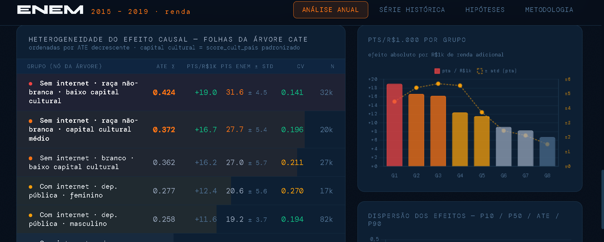

# Modelagem Estatística — Renda como Força Causal no ENEM

> Estimativas causais do efeito da renda familiar e do capital cultural sobre o desempenho no ENEM · 2015–2019 · n = 300.000 candidatos/ano | Para o modelo de regressão linear tomamos um sample de n = 2000 candidatos/ano

**[🔗 Ver resultados interativos](https://joaolucaanalysisproject.netlify.app/)**

---

## Sobre o projeto

Este projeto investiga os fatores que influenciam as notas dos candidatos do ENEM utilizando abordagens estatísticas avançadas. O foco central é **isolar o efeito causal da renda familiar** sobre o desempenho acadêmico, controlando por variáveis sociodemográficas e estruturais.

---

## 🎯 Objetivos de Modelagem

A análise é conduzida através de três pilares metodológicos:

1. **RLM (Huber M-estimator)** — Regressão robusta para identificar correlações e testar hipóteses sobre as variáveis que compõem o perfil do candidato, reduzindo a influência desproporcional da cauda superior da renda declarada.

2. **Double Machine Learning (DML)** — Estimação causal via EconML para isolar o efeito da renda controlando por confundidores observáveis, separando o que é correlação do que é efeito tratamento estimado.

3. **Causal Forest** — Algoritmo de aprendizado de máquina para estimar **efeitos de tratamento heterogêneos (CATEs)**, identificando quais perfis de candidatos respondem mais ou menos à renda como variável causal.

---

## 📊 Principais Resultados (série 2015–2019)

### Efeito causal da renda — DML + Causal Forest

| Ano  | ATE (σ)       | Pts ENEM | IC 95% (pts)  | R$1.000 → pts | σ_ENEM |
|------|---------------|----------|---------------|---------------|--------|
| 2015 | 0,263 ± 0,047 | +19,6    | [12,8 ; 28,4] | +11,8         | 74,6   |
| 2016 | 0,230 ± 0,049 | +17,1    | [9,9 ; 24,3]  | +10,3         | 74,3   |
| 2017 | 0,263 ± 0,056 | +19,5    | [11,4 ; 27,7] | +11,7         | 74,3   |
| 2018 | 0,272 ± 0,054 | +22,6    | [13,9 ; 31,4] | +10,2         | 83,0   |
| 2019 | 0,289 ± —     | +23,3    | —             | +12,0         | —      |

Todos os ATEs significativos a p < 0,001. Distribuição dos efeitos individuais (P10/P50/P90):

| Ano  | P10   | P50   | P90   |
|------|-------|-------|-------|
| 2015 | 0,149 | 0,241 | 0,420 |
| 2016 | 0,138 | 0,224 | 0,328 |
| 2017 | 0,134 | 0,264 | 0,392 |
| 2018 | 0,128 | 0,269 | 0,413 |

- **Crescimento da série:** ATE aumentou ~**+21%** entre 2015 e 2019
- **Média histórica:** R$ 1.000 de renda familiar ≈ **+12 pontos no ENEM** — pode não parecer muito, mas faz muita diferença em cursos mais concorridos, por isso cotas por renda fazem tanto sentido.

### Heterogeneidade por perfil (Causal Forest)

- A razão entre o CATE do grupo mais responsivo e o menos responsivo cresceu de **2,81×** (2015) para **3,86×** (2019)
- Candidatos sem internet, de escola pública não-federal e com baixo capital cultural concentram os maiores efeitos marginais da renda
- Para grupos com acesso já garantido a essas condições, o efeito marginal da renda estagna

### RLM — Coeficientes padronizados (2015, referência)

| Variável           | β (σ)  | Pts ENEM | Sig. | Observação               |
|--------------------|--------|----------|------|--------------------------|
| Renda              | +0,208 | +15,5    | ***  | +3,9 pts/R$1k            |
| Capital cultural   | +0,167 | +12,4    | ***  | +3,0 pts/unidade         |
| Internet (sim)     | +0,168 | +12,5    | ***  | vs. sem internet         |
| Escola federal     | +0,649 | +48,4    | ***  | vs. pública (T=3)        |
| Raça (ref. branca) | —      | —        | n.s. | n.s. na maioria dos anos |
| Idade (spline)     | —      | —        | —    | controlada               |

O modelo RLM se verificou com significância alta (p < 0,001) para renda, capital cultural, tipo de escola e raça (especificamente negros e pardos) ao longo dos anos.

### Screenshots do app



---

## 🔬 Metodologia

### Dados

- **Fonte:** Microdados INEP — ENEM 2015 a 2019
- **Amostra:** ~300.000 candidatos/ano após filtragem (DML + Causal Forest) · 2.000/ano (RLM)
- **Escala de renda:** z-score clássico para estimação · fator R$1k calculado via std robusto (IQR / 1,3489), imune à censura superior declaratória em R$25.425

### Variável de capital cultural (`score_cult_pais`)

Score composto e padronizado (μ=0, σ=1) construído a partir da escolaridade do pai e da mãe, operacionalizado segundo critérios da **ABEP**. Captura o ambiente intelectual do domicílio, não o poder de compra — permitindo separar os mecanismos causais da renda e do capital cultural no modelo DML.

### Stack técnico

| Componente          | Biblioteca                  |
|---------------------|-----------------------------|
| DML + Causal Forest | `EconML`                    |
| RLM Huber           | `statsmodels`               |
| Pipeline de dados   | `pandas`, `numpy`           |
| App interativo      | Netlify (frontend estático) |
| CI/CD               | GitHub Actions              |
| Versionamento       | `DVC` + Git                 |

---

## 📁 Estrutura do Repositório

```
statistical-modelling-enem/
│
├── docs/
│   ├── app.html                         # Frontend do app interativo (Netlify)
│   └── metricas-{year}-enem/
│       ├── metricas_estatisticas.json   # Outputs do RLM por ano
│       └── metricas_causais.json        # Outputs do DML + Causal Forest por ano
│
├── configs/
│   ├── causal_trees.yml                 # parâmetros do DML + Causal Forest
│   ├── configs.yml                      # configurações gerais do projeto
│   └── statistical_tests.yml           # parâmetros dos testes
│
├── dados/
│   └── microdados_enem_2019/            # Amostra de dados (tracked via DVC)
│
├── images/                              # Visualizações exportadas dos notebooks
│
├── legacy/                              # Versões anteriores e experimentos descartados
│
├── notebooks/
│   ├── analise_exploratoria.ipynb
│   ├── causal_tree.ipynb
│   ├── clusters.ipynb
│   ├── modelagem_stat.ipynb
│   └── tratamentos_de_dados.ipynb
│
├── scripts/
│   └── enem_pipeline/
│       ├── gcs_utils.py                 # Autenticação e I/O com Google Cloud Storage
│       ├── ingest_raw_enem.py           # Ingestão dos microdados brutos do INEP
│       ├── process_enem.py              # Limpeza, feature engineering e padronização
│       ├── run_causal_trees.py          # DML + Causal Forest via EconML
│       └── run_statistical_tests.py     # RLM Huber e testes estatísticos
│
├── .github/workflows/                   # CI — GitHub Actions
├── .dvcignore
├── .gitignore
├── pyproject.toml
├── requirements.txt
└── uv.lock
```

---

## ⚙️ Pipeline de Execução (CI + Google Cloud)

O pipeline é orquestrado via **GitHub Actions** e integrado ao **Google Cloud Storage (GCS)**. O fluxo completo:

```
┌─────────────────────────────────────────────────────────────┐
│                     GitHub Actions Runner                   │
│                                                             │
│  1. Checkout do repositório                                 │
│  2. Carrega secrets (GCP_PROJECT_ID, GCS_BUCKET,           │
│     credenciais de service account)                         │
│  3. Autentica no Google Cloud via OIDC                      │
│                          │                                  │
│            ┌─────────────▼──────────────┐                  │
│            │  ingest_raw_enem.py        │                  │
│            │  Lê microdados do bucket   │                  │
│            │  GCS → memória do runner   │                  │
│            └─────────────┬──────────────┘                  │
│                          │                                  │
│            ┌─────────────▼──────────────┐                  │
│            │  process_enem.py           │                  │
│            │  Limpeza + feature eng.    │                  │
│            │  + std robusto IQR         │                  │
│            └──────┬──────────┬──────────┘                  │
│                   │          │                              │
│     ┌─────────────▼──┐  ┌───▼─────────────────┐           │
│     │ run_statistical │  │ run_causal_trees.py  │           │
│     │ _tests.py       │  │ DML + Causal Forest  │           │
│     │ RLM Huber       │  │ CATEs por subgrupo   │           │
│     └─────────────┬──┘  └───┬─────────────────┘           │
│                   └────┬────┘                               │
│                        │                                    │
│         ┌──────────────▼──────────────────┐                │
│         │  metricas_estatisticas.json      │                │
│         │  metricas_causais.json           │                │
│         └──────┬─────────────────┬────────┘                │
│                │                 │                          │
│    ┌───────────▼────┐   ┌────────▼──────────┐             │
│    │  Upload p/ GCS  │   │ GitHub Artifacts  │             │
│    └────────────────┘   └───────────────────┘             │
└─────────────────────────────────────────────────────────────┘
```

---

## ⚠️ Limitações e Humildade Epistêmica

Os resultados pressupõem *unconfoundedness* — ausência de confundidores não-observados como motivação, saúde mental ou qualidade docente. Essa hipótese não pode ser verificada nos microdados do INEP.

- O std robusto (IQR) para o fator R$1k pode subestimar o efeito para candidatos de alta renda — os resultados são mais válidos para a faixa baixa a média da distribuição
- Correlação residual entre renda e capital cultural pode inflar ambos os coeficientes mesmo após separação no DML
- As hipóteses causais interpretativas são plausíveis, não conclusões estabelecidas

> ⚠️ **Projeto em andamento.** Os valores podem ser refinados nas próximas iterações.

---

## Como executar

```bash
# Instalar dependências
pip install -r requirements.txt

# Ou com uv
uv sync

# Rodar pipeline
python scripts/enem_pipeline/run.py
```

Os notebooks em `notebooks/` documentam as etapas de análise exploratória, modelagem RLM, DML e Causal Forest com outputs intermediários.

---

*Microdados INEP · ENEM 2015–2019 · Double Machine Learning (EconML) · RLM statsmodels Huber M-estimator · Causal Forest (EconML)*
